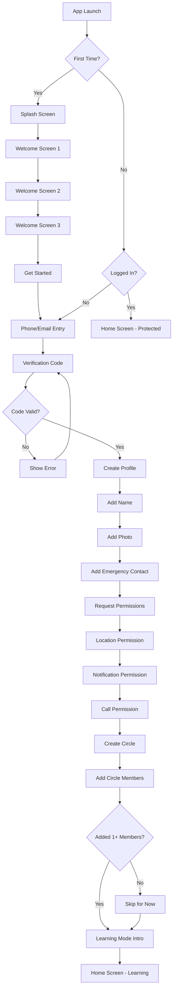
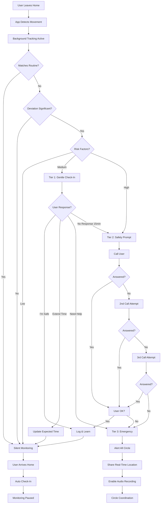
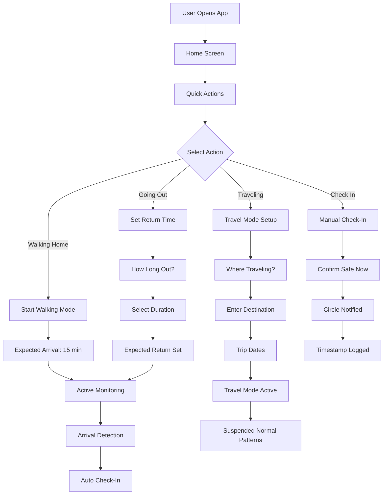
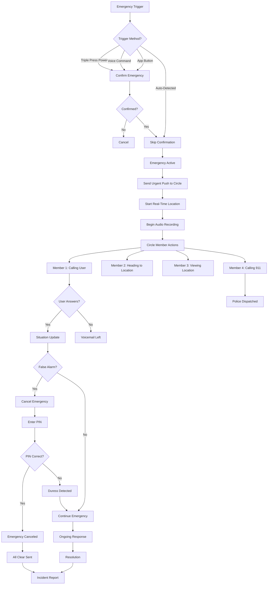
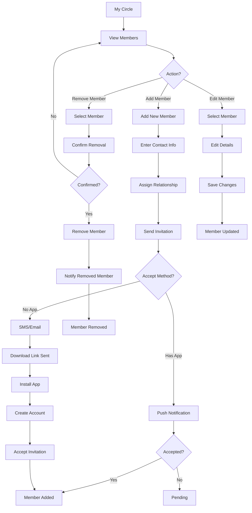
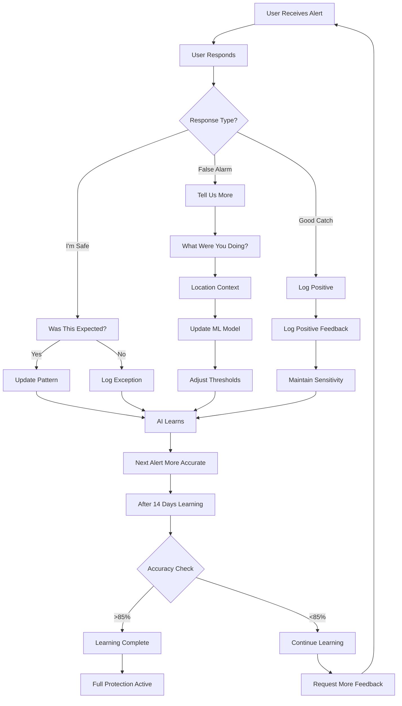
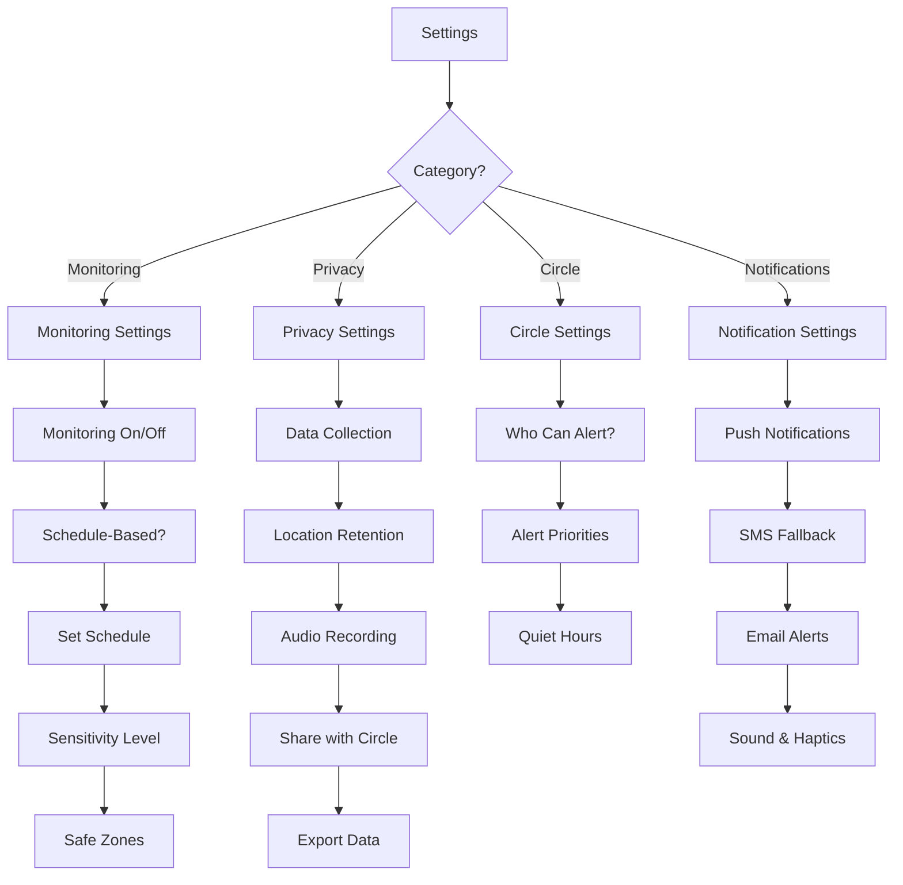

# Circle Safety App - Complete User Flows

## 1. Onboarding & Setup Flow

## 2. Daily Monitoring Flow

## 3. Manual Check-In Flow

## 4. Emergency Activation Flow

## 5. Circle Management Flow

## 6. AI Learning & Feedback Flow

## 7. Settings & Preferences Flow

## Screen Specifications

### Key Screens to Design:

1. **Splash Screen** (500ms)
   - App logo
   - Brand colors
   - Loading indicator

2. **Onboarding Carousel** (3 screens)
   - Screen 1: "AI learns your routine"
   - Screen 2: "Your trusted circle protects you"
   - Screen 3: "Always watching, never intrusive"
   - Skip button, page indicators, Next/Get Started

3. **Registration** 
   - Phone/Email input
   - Verification code entry
   - Profile creation (name, photo, emergency contact)

4. **Permission Requests**
   - Location (Always Allow)
   - Notifications (Critical Alerts)
   - Phone calls (Emergency)
   - Each with clear explanation

5. **Create Circle**
   - Add members interface
   - Relationship labels
   - Invitation sending
   - Skip option

6. **Home Screen - Learning Mode**
   - Learning progress (0-14 days)
   - Quick actions
   - Manual check-in button
   - "Help me learn" prompts

7. **Home Screen - Protected Mode**
   - Status: "You're protected"
   - Expected next activity
   - Quick actions
   - Circle status

8. **Check-In Prompt (Tier 1)**
   - Friendly greeting
   - "Just checking in!"
   - Three buttons: I'm Safe, Extend Time, Need Help

9. **Safety Prompt (Tier 2)**
   - More urgent tone
   - Last known location
   - "Please respond"
   - Call attempts indicator

10. **Emergency Screen (Tier 3)**
    - Red theme
    - Real-time location map
    - Circle coordination chat
    - Audio recording indicator
    - Cancel button (with PIN requirement)

11. **Circle Member View (Emergency)**
    - User's live location
    - Time since alert
    - Actions: Call, Go to Help, Contact 911
    - Other member status
    - Coordination chat

12. **My Patterns**
    - Learned routines visualization
    - Confidence scores
    - Edit/delete patterns
    - Add safe zones

13. **Circle Management**
    - List of members
    - Add/remove members
    - Member status (active, pending, inactive)
    - Invitation management

14. **Settings**
    - Monitoring toggle
    - Sensitivity slider
    - Safe zones
    - Privacy controls
    - Notification preferences
